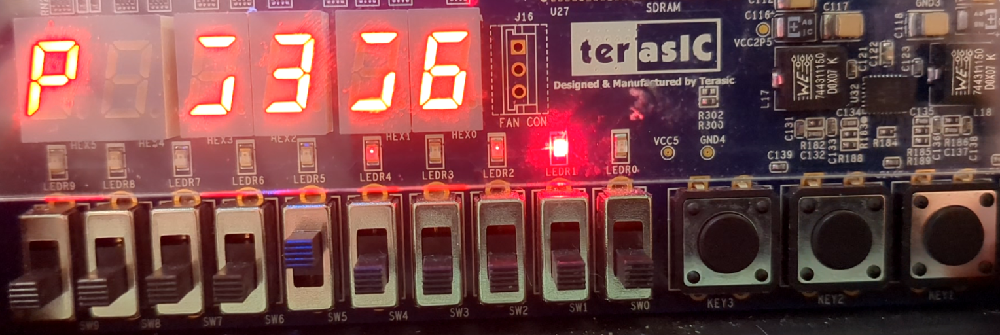

# Blackjack FPGA Game
Blackjack game for DE1-SOC FPGA in VHDL and Verilog. Project by Cameron Archibald and Nader Hdeib for ECED4260 - IC Design & Fabrication in Fall 2025. 

## How to Play
Example videos of possible games are shown below.
1. Set the leftmost 6 switches in a random combination to initialize the deck.
2. Press the rightmost button to reset and shuffle the deck.
3. Press the second rightmost button to deal 2 cards to the player and the dealer.
4. Use the rightmost switch to view the player and dealer hands.
5. Based on the sum of your hand and the dealer hand, you can either:
- Press the second leftmost button to hit (up to 3 times).
- Press the leftmost button to stand.
6. After the player stands, the dealer plays automatically and the result is displayed in the right two LEDs.
- 01: Player win.
- 10: House win.
- 11: Push (tie).
7. Return to step 1 to play again.

## Design Details

### Modules
The program is divided into modules, each of which have their own folder. The top level module is controller which calls instances of the others. Each module has a testbench which was used to extensively test it.

#### Controller
Main game state machine. Performs main game logic, controls the deck to shuffle and get cards, and handles the inputs/outputs to the board.

#### Adder
Adds card values to the player/house hands.

#### Comparator
Compares values for game logic, including player against house, player/house against 21 (bust), and house against 17 (hit/stand).

#### LFSR
6-bit (0-62) random number generator, initialized by six switches. Uses a state machine and control signals, and only outputs values 0-51.

#### Deck
Uses a state machine to shuffle 52 cards into a deck, uses LFSR to get the randomness.

### User Input/Output
#### Buttons
From left to right: stand, hit, deal, reset/shuffle.

#### Switches
Left six: initialization for the LFSR, randomizes the shuffling.

Rightmost: select either displaying the player hand and the dealer hand.

#### 7 Segment Displays
Leftmost: P if displaying player's hand, H if displaying house's hand.

Right five: cards in the player/dealer hand.

#### LEDs
Right two: displays result of the game. 01 -> player win, 10 -> house win, 11 -> push (tie).

### Rule modifications
- Ace only worth 11, not 1 or 11.
- Player can only hit or stand and cannot bet.
- Only one player.
- All house cards are dealt face up.

## Examples
Here are a few examples of how the game runs. 

### Seed 001010, player stands, push
- Player dealt 8 + 9 = 17, house dealt 2 + 4 = 6.
- Player stands, house hits twice to get 7 + 4 + 2 + 4 = 17, must stand on 17.
- Result is a push (11) since both have 17.

https://github.com/user-attachments/assets/f9c403fe-94dd-4271-8118-baf8212d4953

 

### Seed 001010, player hits once, player win.
- Player dealt 8 + 9 = 17, house dealt 2 + 4 = 6.
- Player hits once then stands, getting 4 + 8 + 9 = 21.
- House hits twice, getting A (11) + 7 + 2 + 4 = 24 (bust).
- Result is a player win (01) since house busted.

https://github.com/user-attachments/assets/85dc36b8-6bd1-4ad9-92b4-a060974612b0

 

### Seed 001010, player hits twice, house win.
- Player dealt 8 + 9 = 17, house dealt 2 + 4 = 6.
- Player (foolishly since they had 21) hits twice, getting 7 + 4 + 8 + 9 = 28 (bust).
- House doesn't play since player busted.
- Result is a house win (10) since player busted.

https://github.com/user-attachments/assets/ba848a09-eb5f-45aa-9277-b0b15e77bb82

 

### Seed 000010, player hits once, player win.
- Player dealt J + 6 = 16, house dealt 8 + Q = 18.
- Player hits once then stands, getting 3 + J + 6 = 19.
- House stands since they are 17 or above.
- Result is a player win (01) since player hand exceeds house hand.

https://github.com/user-attachments/assets/cee0912d-3218-4826-9325-78bd86620407

 

### Seed 000010, player hits twice, house win.
- Player dealt J + 6 = 16, house dealt 8 + Q = 18.
- Player hits twice, getting J + 3 + J + 6 = 29 (bust).
- House doesn't play since player busted.
- Result is a house win (10) since player busted.

https://github.com/user-attachments/assets/b5d2aeb2-c717-4425-bec1-da197fc99e6c

